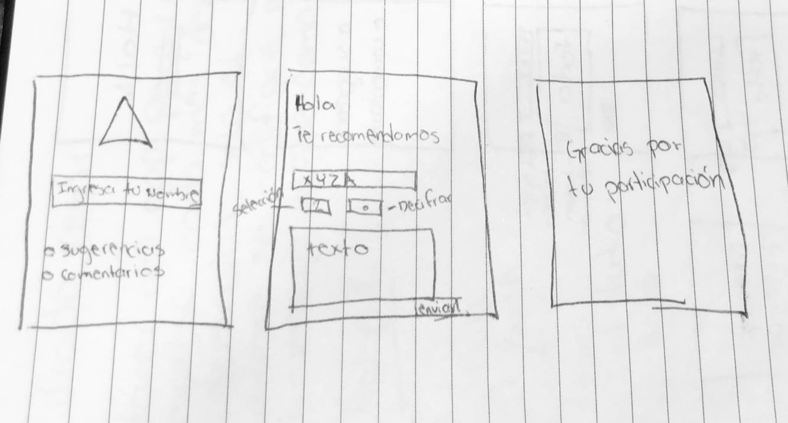
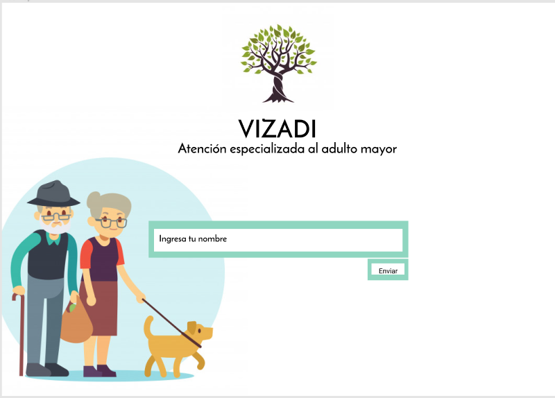
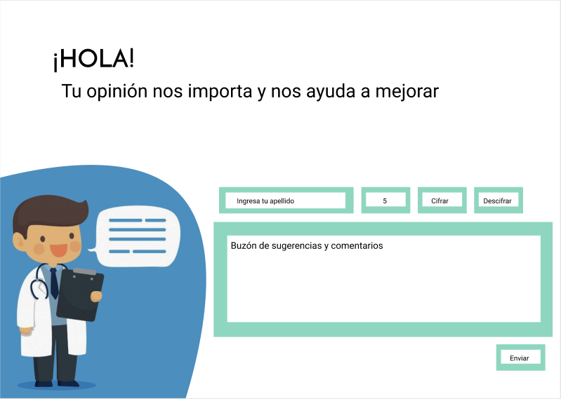
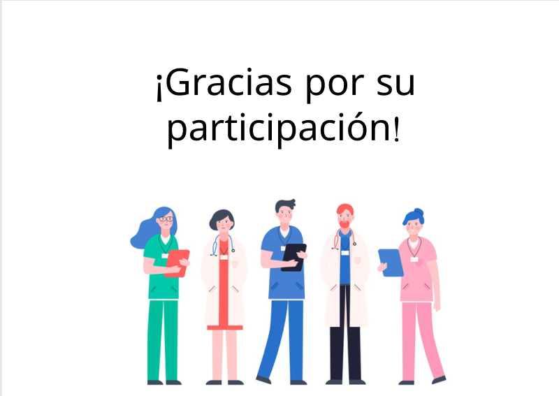

# VIZADI proyecto

## 1. Descripción

Es una página dirigida a una empresa de cuidado de ancianos, enfocada en el personal del equipo multidisciplinario que atiende a los ancianos (médico, trabajadora social, psicólogo, rehabilitador, enfermeras, cuidadores y personal de apoyo).

## 2. Investigación UX

* ¿A quién va dirigido?
  Al equipo multidisciplinario que atiende a los ancianos en la casa de reposo, para expresar las deficiencias y las necesidades para mejorar su desempeño lavoral.

* ¿Problema a resolver?
 Muchos trabajadores no se sienten comodos escribiendo su nombre para expresar las necesidades de la empresa. En esta página el personal podrá expresar sus necesidades de manera anónima.

## 3. Prototipo y feedback

 
En el feedback me dijeron, que había botones que no eran necesarios de poner y explicar mejor ciertas funciones para que se entendiera mejor la página.

## 4. Wireframe

## 5. Resultado final

