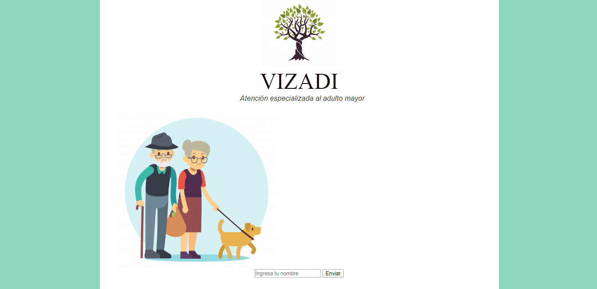
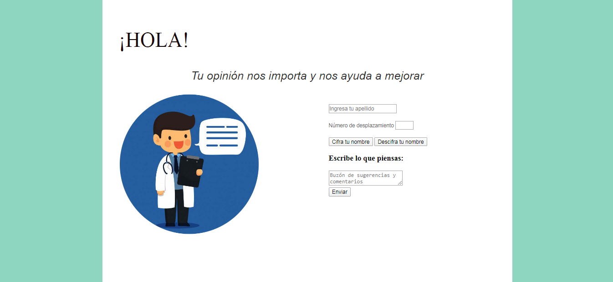

# VIZADI proyecto

## 1. Descripción

Es una página dirigida a una empresa de cuidado de ancianos, enfocada en el personal del equipo multidisciplinario que atiende a los ancianos (médico, trabajadora social, psicólogo, rehabilitador, enfermeras, cuidadores y personal de apoyo).

## 2. Investigación UX

* ¿A quién va dirigido?
  Al equipo multidisciplinario que atiende a los ancianos en la casa de reposo, para expresar las deficiencias y las necesidades para mejorar su desempeño lavoral.

* ¿Problema a resolver?
 Muchos trabajadores no se sienten comodos escribiendo su nombre para expresar las necesidades de la empresa. En esta página el personal podrá expresar sus necesidades de manera anónima.

## 3. Prototipo y feedback

 
En el feedback me dijeron, que había botones que no eran necesarios de poner y explicar mejor ciertas funciones para que se entendiera mejor la página.

## 4. Wireframe

## 5. Resultado final

## 5. Objetivos de aprendizaje

El objetivo principal de aprendizaje es adquirir experiencia desarrollando
aplicaciones web (WebApp) que interactúen con el usuario a través del navegador
y la lógica, utilizando HTML5, CCS3 y JavaScript como herramientas.

Reflexiona y luego marca los objetivos que has llegado a **entender** y **aplicar** en tu proyecto.

### UX

- [:blush:] Diseñar la aplicación pensando y entendiendo al usuario.
- [:blush:] Crear prototipos para obtener feedback e iterar.
- [:blush:] Aplicar los principios de diseño visual (contraste, alineación, jerarquía).

### HTML y CSS

- [:flushed:] Uso correcto de HTML semántico.
- [:blush:] Uso de selectores de CSS.
- [:flushed:] Construir tu aplicación respetando el diseño realizado (maquetación).

### DOM

- [:blush:] Uso de selectores del DOM.
- [:flushed:] Manejo de eventos del DOM.
- [:flushed:] Manipulación dinámica del DOM.

### Javascript

- [:blush:] Manipulación de strings.
- [:blush:] Uso de condicionales (if-else | switch).
- [:blush:] Uso de bucles (for | do-while).    
- [:blush:] Uso de funciones (parámetros | argumentos | valor de retorno).
- [:blush:] Declaración correcta de variables (const & let).

### Testing
- [:flushed:] Testeo de tus funciones.

### Git y GitHub
- [:blush:] Comandos de git (add | commit | pull | status | push).
- [:blush:] Manejo de repositorios de GitHub (clone | fork | gh-pages).

### Buenas prácticas de desarrollo
- [:blush:] Uso de identificadores descriptivos (Nomenclatura | Semántica).
- [:blush:] Uso de linter para seguir buenas prácticas (ESLINT).

